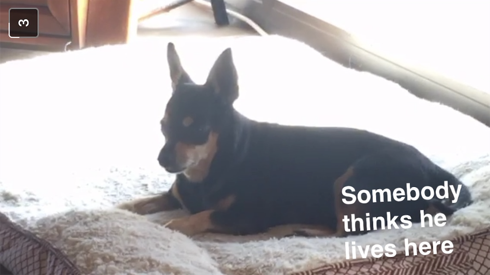

<!DOCTYPE html>
<html>

<body bgcolor="#ECF0E0">

  <button class="tablinks" onclick="window.location.href='https://day-z4.github.io/Portfolio/aboutme.html';" id="myButton">ABOUT ME</button>
  <button class="tablinks" onclick="window.location.href='https://www.google.com';" id="myButton">PROJECTS</button>

<h1>My Portfolio
</h1>

<b1> HI im Day-z. Im not sure what to put here. But I have 2 dogs. kobe and lady. I dont have any pictures of them. But I do have a picture of my friends dog. He is my favorite dog and his name is Danté. </b1>

<h1>Danté</h1> 

<tr><th></th></tr>
<tr><th></th></tr>
<tr><th></th></tr> 

<h2>Here is some things about me:</h2>

<ul>
  <li>Im a dog person.</li>
  <li>I really like Danté.</li>
  <li>I want a Newfoundland.</li>
  <li>Once I was at great America and I lost my hat. </li>

<tr><th></th></tr> 

<li>I bought it again the next day. </li>
<li>I don't like going on hikes but if someone buys me breakfast ill do it. </li>
</ul>

<head>
